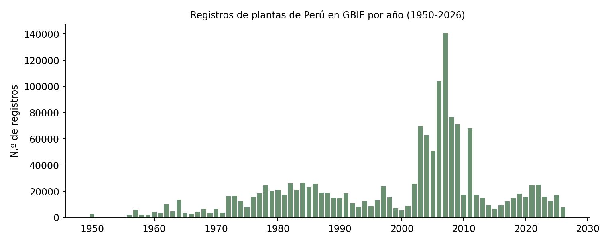
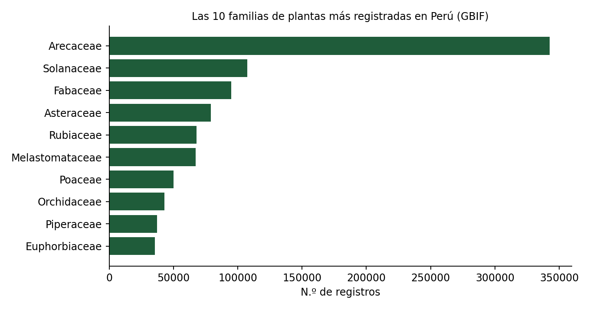
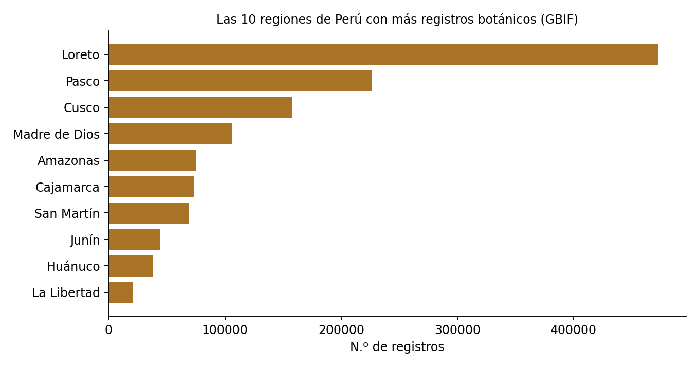

# 🌿 Biodiversidad vegetal de Perú: un panorama con datos de GBIF

[](https://www.python.org/) [](https://pandas.pydata.org/) [](https://www.sqlite.org/) [](https://jupyter.org/) [](https://powerbi.microsoft.com/)

> Análisis exploratorio de 1,842,228 registros de plantas de Perú, consultados en vivo a la API pública de [GBIF](https://www.gbif.org/) (Global Biodiversity Information Facility): cómo ha evolucionado la actividad de registro en el tiempo, qué familias botánicas dominan y en qué regiones se concentra.
>
> Es mi primer proyecto que consume una API pública en vivo en lugar de partir de un archivo ya preparado.

**Resultado en una línea:** más de un tercio de todos los registros de plantas de Perú en GBIF (37%) corresponde a una sola familia, **Arecaceae** (las palmeras), y **Loreto** y **Pasco** concentran casi la mitad de los registros con región conocida — pero el pico de 2006-2008 que explica buena parte de esto resultó ser la publicación masiva de solo dos bases de datos históricas (un estudio danés de transectos de palmeras y el herbario del Jardín Botánico de Missouri), no un salto real en la exploración de campo.

---

## 📑 Tabla de contenido

**Sección técnica**
- [Objetivo](#-objetivo)
- [Datos](#-datos)
- [Tecnologías](#-tecnologías)
- [Metodología](#-metodología)
- [Consultas SQL](#-consultas-sql)
- [Limitaciones](#-limitaciones)
- [Cómo ejecutar](#-cómo-ejecutar)
- [Estructura del repositorio](#-estructura-del-repositorio)

**Sección de negocio**
- [Contexto y preguntas](#-contexto-y-preguntas)
- [Resultados](#-resultados)
- [Hallazgos clave](#-hallazgos-clave)
- [Recomendaciones](#-recomendaciones)
- [Próximos pasos](#-próximos-pasos)

---

## 🧭 SECCIÓN TÉCNICA

### 🎯 Objetivo

Consultar la API pública de GBIF para obtener un panorama de la actividad de registro botánico en Perú — por año, familia y región — y comunicar los hallazgos con sus límites, sin confundir "actividad de registro" con "biodiversidad real" ni con "especies nuevas descubiertas".

### 🗂️ Datos

1,842,228 registros de plantas (Kingdom Plantae) de Perú, consultados directamente de GBIF vía su API REST pública (sin necesidad de clave). Diccionario completo, limpieza aplicada y limitaciones de cada tabla en [`data/README.md`](data/README.md).

### ⚙️ Tecnologías

- **Lenguaje:** Python (pandas)
- **Fuente:** API REST de GBIF (`api.gbif.org`)
- **Consultas:** SQL (sintaxis SQLite)
- **Dashboard:** Power BI
- **Entorno:** Jupyter Notebook

### 🔬 Metodología

1. **Consulta a la API:** tres peticiones agregadas (`facet=year`, `facet=familyKey`, `facet=stateProvince`) con `limit=0`, para obtener solo conteos, no los 1.8 millones de registros individuales.
2. **Resolución de familias:** los códigos numéricos de familia se resolvieron a nombre consultando `/v1/species/{key}` para las 10 más frecuentes.
3. **Limpieza de regiones:** normalización de tildes y variantes de escritura (`Cusco`/`Cuzco`, `San Martín`/`San Martin`, etc.) y fusión de duplicados.
4. **Validación:** las sumas de cada tabla se comprobaron contra el total real que devuelve la API (`count: 1,842,228`), para saber qué porcentaje de los datos cubre cada tabla limpia.
5. **Visualización:** serie de tiempo, top 10 familias y top 10 regiones.

Notebook completo: [`notebooks/01_analisis_gbif_peru.ipynb`](notebooks/01_analisis_gbif_peru.ipynb).

### 🧾 Consultas SQL

| Archivo | Qué hace |
|---|---|
| [`sql/01_crear_tablas.sql`](sql/01_crear_tablas.sql) | Define las tres tablas |
| [`sql/02_registros_por_decada.sql`](sql/02_registros_por_decada.sql) | Agrupa los registros por década |
| [`sql/03_pareto_familias.sql`](sql/03_pareto_familias.sql) | % y % acumulado de registros por familia (función de ventana) |
| [`sql/04_top_regiones.sql`](sql/04_top_regiones.sql) | Top 3 regiones y su participación |
| [`sql/05_anios_pico.sql`](sql/05_anios_pico.sql) | Los 5 años con más registros desde 1950 |

Fragmento representativo, el Pareto de familias:

```sql
SELECT familia, registros,
       ROUND(100.0 * registros / (SELECT SUM(registros) FROM registros_por_familia), 1) AS pct,
       ROUND(100.0 * SUM(registros) OVER (ORDER BY registros DESC) /
             (SELECT SUM(registros) FROM registros_por_familia), 1) AS pct_acumulado
FROM registros_por_familia
ORDER BY registros DESC;
```

### ⚠️ Limitaciones

- **"Actividad de registro" no es "biodiversidad real" ni "especies nuevas":** este dataset cuenta cuántas veces se documentó una observación o espécimen, no cuántas especies existen ni cuántas se descubrieron. Lo aclaro porque la idea original de este proyecto era medir especies nuevas por año, y los datos públicos no permiten esa medición con precisión — lo documento en vez de forzar una conclusión que los datos no respaldan.
- **El pico de 2006-2008 está explicado (ver sección "Hallazgo adicional" más abajo):** no es un salto real en la exploración de campo, sino la publicación masiva de dos bases de datos históricas hacia GBIF.
- **Solo se resolvieron 10 de los 20 códigos de familia** consultados; las otras 10 quedaron fuera del análisis.
- **22.5% de los registros no tiene región especificada** en GBIF.
- **Los datos de año cubren el 87% del total** (los años con muy pocos registros, fuera del top 100, no se incluyeron).

### 🚀 Cómo ejecutar

```bash
git clone https://github.com/danielmg-data/biodiversidad-plantas-peru-gbif.git
cd biodiversidad-plantas-peru-gbif

pip install pandas matplotlib jupyter

jupyter notebook notebooks/01_analisis_gbif_peru.ipynb
```

El notebook vuelve a consultar los archivos de `data/raw/` (ya guardados), no depende de que la API esté disponible en el momento de ejecutarlo.

### 🗃️ Estructura del repositorio

```
biodiversidad-plantas-peru-gbif/
├── README.md
├── data/
│   ├── README.md              ← diccionario de datos y limpieza aplicada
│   ├── year_clean.csv
│   ├── family_clean.csv
│   ├── region_clean.csv
│   └── raw/                   ← respuestas originales de la API de GBIF
├── notebooks/
│   └── 01_analisis_gbif_peru.ipynb
├── sql/
│   ├── 01_crear_tablas.sql
│   ├── 02_registros_por_decada.sql
│   ├── 03_pareto_familias.sql
│   ├── 04_top_regiones.sql
│   └── 05_anios_pico.sql
└── images/
```

---

## 💼 SECCIÓN DE NEGOCIO

### 🏢 Contexto y preguntas

Una organización de conservación o un programa de ciencia ciudadana (marco de referencia de este análisis) quiere entender dónde está más activa la documentación botánica en Perú, para orientar dónde reforzar esfuerzos de registro.

1. **¿Qué familias de plantas están mejor documentadas en Perú, y cuáles podrían estar sub-representadas?**
2. **¿En qué regiones se concentra la actividad de registro, y dónde hay vacíos de información?**

### 📊 Resultados







| Familia | Registros | % del top 10 |
|---|---|---|
| Arecaceae | 342,525 | 37.0% |
| Solanaceae | 107,510 | 11.6% |
| Fabaceae | 95,052 | 10.3% |
| Asteraceae | 79,045 | 8.5% |
| Rubiaceae | 67,800 | 7.3% |

| Región | Registros | % del total con región conocida |
|---|---|---|
| Loreto | 472,779 | 33.1% |
| Pasco | 226,678 | 15.9% |
| Cusco | 157,445 | 11.0% |

### 💡 Hallazgos clave

- **Arecaceae domina con el 37% del top 10 de familias** — casi el triple que la segunda (Solanaceae). Pero esto no refleja biodiversidad real: como se confirma más abajo, se debe en gran parte a un estudio danés que muestreó específicamente palmeras en 500 transectos.
- **El top 10 de familias representa solo ~50% de los 1.8 millones de registros totales:** hay una diversidad enorme repartida en cientos de familias más pequeñas, no solo en las 10 principales.
- **Loreto, Pasco y Cusco concentran el 60% de los registros con región conocida.** Pasco destaca por su tamaño relativamente pequeño — probablemente por las colecciones históricas del Jardín Botánico de Missouri en el Parque Nacional Yanachaga-Chemillén (ver "Hallazgo adicional").
- **La década 2000-2009 triplica a la anterior** (616,012 vs. 214,907 registros), con un pico extremo en 2006-2008 que probablemente responde a un proyecto puntual de digitalización, no a un salto real en exploración de campo.

### ✅ Recomendaciones

1. **No usar este panorama como medida de biodiversidad ni de especies nuevas** — es actividad de registro. Para esas preguntas se necesitan fuentes especializadas (IPNI, publicaciones taxonómicas).
2. **No usar el pico de 2006-2008 como referencia de "años de mayor exploración de campo"** — ya se confirmó que corresponde a la publicación masiva de dos bases de datos históricas, no a un aumento real del muestreo ese año.
3. **Priorizar el registro en regiones con pocos datos** (como Ica, Tacna o Huancavelica) si el objetivo es tener un panorama más parejo del país.
4. **Resolver los 10 códigos de familia pendientes** para completar el panorama de familias más allá del top 10 actual.

### 🔍 Hallazgo adicional: ¿qué causó el pico de 2006-2008?

Investigué de dónde venía el 59% + 24% = 83% de los 321,030 registros publicados entre 2006 y 2008 (consulta `facet=datasetKey`, filtrando por esos años), identificando cada dataset vía `/v1/dataset/{key}`:

| Dataset | Institución | Registros (2006-2008) | % del pico |
|---|---|---|---|
| Aarhus University Palm Transect Database | Universidad de Aarhus, Dinamarca (H. Balslev) | 190,269 | 59.3% |
| Tropicos Specimens Non-MO | Jardín Botánico de Missouri (MBG) | 75,784 | 23.6% |

**No es un salto real en la exploración de campo de esos años.** Son dos bases de datos históricas, acumuladas durante años de trabajo de campo, que se publicaron masivamente hacia GBIF en ese periodo:

- La de Aarhus es un estudio sistemático de **500 transectos de 5×5 m dedicados específicamente a palmeras (Arecaceae)** en bosques tropicales americanos — esto también explica por qué Arecaceae es, por lejos, la familia más registrada de todo el dataset (342,525 registros): no refleja que Perú tenga más palmeras que cualquier otra familia, sino que hubo un esfuerzo de muestreo dedicado solo a ellas.
- La del MBG corresponde a su base Tropicos, que incluye más de 4.7 millones de especímenes digitalizados a nivel mundial, entre ellos los del programa "Floristic Diversity of the Protected Natural Areas in Center and Southern Peru" en el Parque Nacional Yanachaga-Chemillén (Pasco) — el mismo programa de colecta del MBG con el que entrené en 2007 en ese parque.

**Conclusión revisada:** el panorama "por familia" y "por año" de este proyecto refleja en gran parte el diseño de dos estudios puntuales, no un muestreo representativo de toda la flora del Perú. Es una limitación importante que cambia cómo se debe leer el gráfico de familias: Arecaceae no es necesariamente la familia con más presencia real en el país, es la más intensamente muestreada por un proyecto específico.

### 🔭 Próximos pasos

- Confirmar si Loreto (selva baja, hábitat típico de palmeras) está dominado por el dataset de Aarhus, y si Pasco está más influenciado por el del MBG, cruzando `datasetKey` con `stateProvince`.
- Completar la resolución de familias más allá del top 10.
- Cruzar estos datos con las áreas naturales protegidas del Perú, para ver qué proporción de los registros cae dentro de zonas de conservación.

---

## 👤 Autor

**Daniel Medina Guzmán** · Analista de Datos · [LinkedIn](https://www.linkedin.com/in/danielmg-data) · [GitHub](https://github.com/danielmg-data) · <medinaguzman.da@gmail.com>
